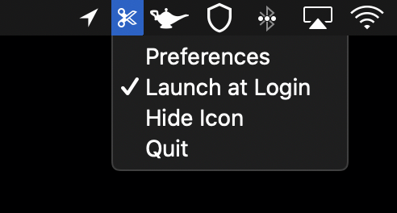

  

# UTMBeGone

## Real friends remove UTM tags before sharing links  😊

Remove UTM tags (and more) when you copy URLs to your pasteboard.

With UTMBeGone you can prevent people from tracking you and the friends you share links with. The app comes with a pre-set of UTM tags, but you can add/remove as many tags you want.

# How it works?
Every time you copy a valid URL to your pasteboard UTMBeGone will remove all queries that you configured on UTMBeGone. 

For example, if you copy "http://fakestalkerwebsite.com?randomQuery=123&utm_source=we_are_stalking_you, you will actually paste http://fakestalkerwebsite.com?randomQuery=123 to your friends.

UTMBeGone comes with a preset of query items to be removed, but you can add or remove anything you like.

Protect the people you share links with from being tracked :)

## Screenshots
 

 

## Privacy
This project does not track anything you do ( it would be ironic right? 🙃), there are no analytics, no telemetry and it's a 100% offline app.

## Download
UTMBeGone is a free and open source hobby project of mine. Feel free to download the project and run it anywhere you like!
If you want to support its development you can buy it on the [App Store](https://apps.apple.com/us/app/utmbegone/id1530867730?mt=12) for those nice automatic updates :)

## FAQ

### I've removed the icon from the menu bar and now it's gone, how do I add it back?
If you remove/hide the icon from the menu bar the app will keep running, if you want to see it back again just open your Application's folder and double click on the UTMBeGone icon to see it again.

### Will this app remove all "utm" tags from all texts I copy?
No, UTMBeGone only removes these tags from valid URLs, which means they need to start with http(s):// . This is intentional because I didn't want to randomly remove tags from texts being copied, it would be very annoying.
